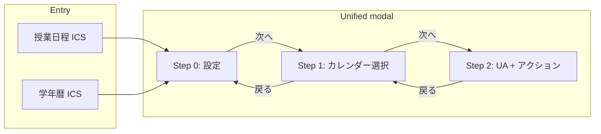

# 统一 ICS 下载模态与智能流程

## 现状

- **两个模态**：[IcsExportModal.vue](src/components/IcsExportModal.vue)（授業スケジュール）与 [CalendarIcsExportModal.vue](src/components/CalendarIcsExportModal.vue)（学年暦），由 [MainApp.vue](src/views/MainApp.vue) 打开（授業日程リスト旁 ICS 图标、以及头部「学年暦を ICS でダウンロード」按钮）。
- **两个入口**：授業日程リスト ICS 图标 → `openIcsExportModal`；头部日历图标 → `openCalendarIcsModal`。
- **QR**：两模态均生成 `origin + base + "/d?q=" + encodePayload(payload)`，并打开 [IcsQrModal.vue](src/components/IcsQrModal.vue)；扫码后进入 [DownloadIcsPage.vue](src/views/DownloadIcsPage.vue)（`/d`），该页解码 `q`、加载日历 YAML、显示 設定内容 与单一「ダウンロード」按钮，再构建 ICS blob 并触发下载。

## Target architecture

- **QR 流程**：主应用通过 `?action=calendar_modal&target=apple|google|outlook|other&q=BASE64` 打开。应用加载后若存在 `action=calendar_modal`，则解码 `q`，直接以 **Step 2** 打开统一模态，日历目标来自 `target=`，payload 来自 `q`（不经过 Step 0/1）。

---

## 1. 主画面与单一模态入口

- 在 [MainApp.vue](src/views/MainApp.vue) 中：
  - 授業日程リスト 的 ICS 按钮：`title` 改为「カレンダーに追加」，`@click` 改为打开统一模态并传入 `source: 'schedule'`。
  - 头部日历按钮：`title` 改为「カレンダーに追加」，改为打开统一模态并传入 `source: 'calendar'`。
  - 用单一组件 `<CalendarAddModal>`替换现有的 `<IcsExportModal>` 与 `<CalendarIcsExportModal>`。
- 新组件接收：
  - `source: 'schedule' | 'calendar'`（区分授業スケジュール / 学年暦）。
  - 当 `source === 'schedule'` 时：与当前 IcsExportModal 相同 props（`schedule`, `semester`, `year`, `courseDays`, `classesPerWeek`, `selectedDaysOfWeek`, `deliveryModes`, `initialSubjectName`, `initialIcsOptions` 等）。
  - 当 `source === 'calendar'` 时：与当前 CalendarIcsExportModal 相同（`events`, `year`, `initialCalendarIcsOptions`）。
  - 可选：`initialStep`、`initialCalendarTarget`、`initialPayload`（从 URL `action=calendar_modal&target=...&q=...` 打开时使用）。

---

## 2. 统一模态：Step 0（設定）

- **内容**：`source === 'schedule'` 时渲染当前 IcsExportModal 的表单（科目名、時限・教室、リマインド）；`source === 'calendar'` 时渲染当前 CalendarIcsExportModal 的表单（含める種別、授業実施、リマインド、終日注記）。
- **底部**：仅 **「次へ」**。不显示「ICS をダウンロード」与「スマホ/タブレットでダウンロード」。
- **校验**：与现有一致（例如 schedule 时科目名必須；calendar 时至少选一种含める種別）。无效或无数据时禁用「次へ」。
- 点击「次へ」：校验通过后保存表单状态，进入 Step 1。

---

## 3. Step 1：カレンダーの選択

- **头部**：显示「戻る」按钮，返回 Step 0。
- **选项**（单选或卡片）：
  - **iOSカレンダー（iPhone, Macなど）**
  - **Google カレンダー**
  - **Outlook カレンダー**
  - **その他（.icsファイルを直接ダウンロード）**
  - その他 的交互：采用「クリックで即DL」。
- 点击「次へ」：保存所选日历类型，进入 Step 2。

---

## 4. Step 2：UA 判定とアクション提示

- **头部**：「戻る」返回 Step 1。
- **上方区块**：展示 設定内容（与 [DownloadIcsPage.vue](src/views/DownloadIcsPage.vue) 的摘要一致：種別、年度、学期/科目名 或 含める種別・授業実施・リマインド 等），由当前表单状态或从 URL 打开时的 `initialPayload` 推导。
- **环境行**：显示「現在認識されている環境」，例如 `[ Mac + Chrome ▼ ]`。可点击展开下拉，手动切换（Mac/Windows/iOS+Safari/iOS+Chrome/Android/その他）。覆盖结果保存在模态内部状态；默认由 UA 检测得到。
- **UA 检测工具**：新增工具（如 `src/utils/uaDetection.ts`），基于 `navigator.userAgent` / `navigator.platform` 判断 `os: 'mac'|'windows'|'ios'|'android'`、`browser: 'safari'|'chrome'|'other'`，作为环境选择器的默认值。
- **内容矩阵**（按所选日历类型与检测/覆盖后的环境）：按规格实现以下文案与按钮：

| カレンダー  | 環境        | UI                                                                                                                                                                                                         |
| ----------- | ----------- | ---------------------------------------------------------------------------------------------------------------------------------------------------------------------------------------------------------- |
| **iOS**     | Mac         | 左：[ カレンダーファイルダウンロード ]；右：「ダウンロードしたファイルをダブルクリックするだけで追加されます。」                                                                                           |
| **iOS**     | Windows     | 左：QR + [ URLをコピー ]；右：「iPhone/iPadでQRコードを読み取り、端末から直接追加してください。」                                                                                                          |
| **iOS**     | Android     | 説明文のみ：「Android端末からiOSカレンダーへの追加はできません。」                                                                                                                                         |
| **iOS**     | iOS+Safari  | 上：[ カレンダーに追加 ]；下：「タップした後、自動的にカレンダーが起動します。『すべて追加』をタップしてください。」                                                                                       |
| **iOS**     | iOS+他      | 上：[ URLをコピー ]；下：「⚠️ 現在のブラウザ（Chrome等）では直接追加できません。URLをコピーし、標準のSafariアプリに貼り付けて開いてください。」                                                            |
| **Google**  | Mac/Windows | 左：[ カレンダーファイルダウンロード ]；右：説明文（Googleカレンダー Web → 右上の⚙️ → 設定 → インポートとエクスポート）；+ [ Android スマホで追加する手順を見る ] → 遷移して Android + Google の説明を表示 |
| **Google**  | iOS         | 説明文のみ（パソコンから操作推奨、同期の説明）                                                                                                                                                             |
| **Google**  | Android     | 上：[ カレンダーファイルダウンロード ]；下：説明文（通知領域よりダウンロードの通知をタップし、「カレンダーで開く」等を選択して予定を追加してください。）                                                   |
| **Outlook** | Mac/Windows | 左：[ カレンダーファイルダウンロード ]；右：説明文（ダウンロードしたファイルをダブルクリックして、Outlookに追加してください。）                                                                            |
| **Outlook** | iOS/Android | 説明文のみ（パソコンから操作してください。追加した予定は自動的にスマートフォンにも同期されます。）                                                                                                         |
| **その他**  | 全環境      | 即 DL または DLボタンのみ（仕様に合わせて実装）                                                                                                                                                            |

- **QR 码**：仅在矩阵要求时显示（例如 iOS + Windows）。QR 链接指向**主应用**：`origin + base + "/?action=calendar_modal&target=" + selectedTarget + "&q=" + encodePayload(currentPayload)`。用户扫码后进入主应用，模态在 Step 2 打开且日历类型已选；手机端 UA 决定具体展示块（如 iOS+Safari 或 iOS+他）。
- **URLをコピー**：将上述同一 URL（含 `action=calendar_modal&target=...&q=...`）复制到剪贴板。

---

## 5. 触发下载与 “カレンダーに追加”

- **カレンダーファイルダウンロード**：模态发出事件（如 `download-ics`），携带解析后的 payload（当前表单或 `initialPayload`）。MainApp 持有 `calendarData` 与现有导出逻辑，据此构建 ICS blob 并触发下载；复用 [DownloadIcsPage.vue](src/views/DownloadIcsPage.vue) 的 `doDownload()` 及现有 `exportToICS` / `exportCalendarEventsToIcs`。可将「根据 payload + calendarData 构建 blob 并触发下载」抽成共用方法（如 `utils/export.ts` 或新 `utils/icsDownload.ts`），供 MainApp 调用（原 DownloadIcsPage 的 `doDownload()` 逻辑迁入此处或复用）。
- **カレンダーに追加（iOS Safari）**：与 カレンダーファイルダウンロード 相同，复用同一套逻辑——模态发出 `download-ics`（携带 payload），MainApp 或共用方法根据 payload + calendarData 构建 ICS blob 并触发下载（即与 [DownloadIcsPage.vue](src/views/DownloadIcsPage.vue) 的 `doDownload()` 相同流程）。在 iOS Safari 上该下载流程已测试可用，可正常唤起日历添加。
- **その他**：若为 “即DL”，行为同 カレンダーファイルダウンロード。。

---

## 6. URL 参数与加载时自动打开（QR 流程）

- **路由**：删除 `/d` 路由；保持 `/` 与 admin。不新增路由，在 `/`（MainApp）上使用 query。
- 在 [MainApp.vue](src/views/MainApp.vue) (or the root component that mounts first):
  - On mount (and on `useRoute()` change if using Vue Router), read `action=calendar_modal`, `target=apple|google|outlook|other`, `q=BASE64`.
  - If `action === 'calendar_modal'` and `q` is present: decode `q` with `decodePayload(q)`; if valid, set modal state: `visible = true`, `initialStep = 2`, `initialCalendarTarget = target`, `initialPayload = decoded`. Optionally replace the current URL (without the `action`/`target`/`q` params) after opening the modal to avoid re-triggering on refresh.
  - Modal opens directly at Step 2, with 設定内容 from `initialPayload` and environment from UA (and optional manual override). No Step 0/1.
- **QR / “URLをコピー” generation**: When building the link for QR or copy, use:
  - `target`: current Step 1 selection (e.g. `apple`, `google`, `outlook`, `other`).
  - `q`: `encodePayload(payload)` where `payload` is the current form state (schedule or calendar payload). So the same unified modal and same payload format as today; only the URL changes from `/d?q=...` to `/?action=calendar_modal&target=...&q=...`.

---

## 7. DownloadIcsPage 与 /d 路由的扱い

- 删除 `/d` 路由及对应的 [DownloadIcsPage.vue](src/views/DownloadIcsPage.vue)。 “direct download” only. Use it when you want to open a minimal page that just shows 設定内容 and one button (e.g. for “その他” → “DLボタンのみの画面へ”, or for the iOS “カレンダーに追加” link that opens in Safari). When opened with `q=` only (no `action=calendar_modal`), 行为不变：显示 設定内容 + ダウンロード，在该页加载 calendarData 并根据 `q` 构建 blob。

---

## 8. 文件与依赖变更

| 项目                                           | 变更内容                                                                                                                                                                                                                               |
| ---------------------------------------------- | -------------------------------------------------------------------------------------------------------------------------------------------------------------------------------------------------------------------------------------- |
| 新组件                                         | `CalendarAddModal.vue`：实现 Step 0（schedule/calendar 表单）、Step 1（カレンダーの選択）、Step 2（UA + 矩阵）。                                                                                                                       |
| 新工具                                         | `src/utils/uaDetection.ts`：提供 `getUA() => { os, browser }`，以及可选的下拉覆盖项列表。                                                                                                                                              |
| 可选共用方法                                   | 将 “build ICS blob from payload + calendarData and trigger download” 集中到一处（如 `utils/icsDownload.ts` 或 `export.ts` 内），供 MainApp 调用（原 DownloadIcsPage 的 `doDownload()` 逻辑迁入此处或复用）。                           |
| MainApp.vue                                    | 两处按钮统一为 “カレンダーに追加” 「カレンダーに追加」；只挂载一个统一模态；处理 `download-ics` 并携带 payload；在 mount/route 中读取 `action=calendar_modal&target=&q=`，以 `initialPayload` 与 `initialCalendarTarget` 打开 Step 2。 |
| IcsExportModal.vue, CalendarIcsExportModal.vue | 逻辑迁移到统一模态后删除。                                                                                                                                                                                                             |
| IcsQrModal.vue                                 | Can be removed; QR and “URLをコピー” 并入统一模态的 Step 2。                                                                                                                                                                           |
| Router                                         | 删除 `/d` 路由；仅保留 `/` 与 admin；生成 QR/URL 时 base path 正确（已使用 `import.meta.env.BASE_URL`）。                                                                                                                              |
| DownloadIcsPage.vue、路由 /d                   | 删除。逻辑迁入共用方法或 MainApp 后移除该页面及路由。                                                                                                                                                                                  |

---

## 9. 实现顺序

1. 新增 `uaDetection.ts` 及共用 ICS 构建与下载方法。
2. Implement `UnifiedCalendarAddModal`: Step 0（两种表单）、Step 1（四种选项）、Step 2（設定内容 + 环境选择器 + 矩阵及全部文案与按钮）。用现有 `encodePayload` 与表单状态生成 QR/URL 与事件用 payload。
3. 在 MainApp 中：用统一模态替换两个旧模态；从两个入口传入对应 `source`；处理 `download-ics`（构建 blob 并触发下载）；增加 URL 参数处理，用 `initialPayload` 与 `initialCalendarTarget` 打开 Step 2。
4. Change QR/“URLをコピー” to use `/?action=calendar_modal&target=...&q=...`.
5. 实现 “カレンダーに追加” iOS Safari 的「カレンダーに追加」与 その他（均复用同一套「构建 blob + 触发下载」逻辑）。
6. 删除 IcsExportModal、CalendarIcsExportModal、IcsQrModal；删除 `/d` 路由及 DownloadIcsPage.vue。 “仅 DL” page.

This yields a single, consistent “カレンダーに追加” flow with calendar choice and UA-based instructions, and QR that opens the app at Step 2 with the chosen calendar type.
